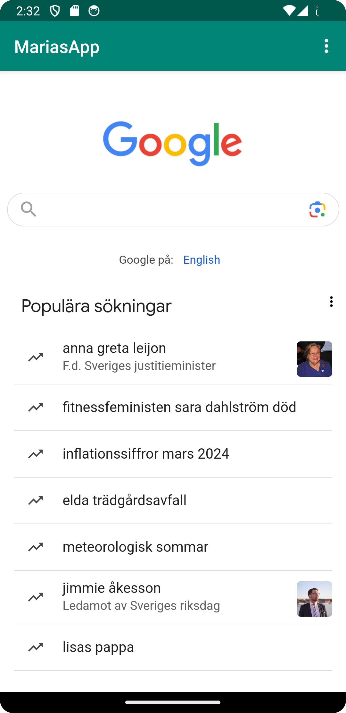
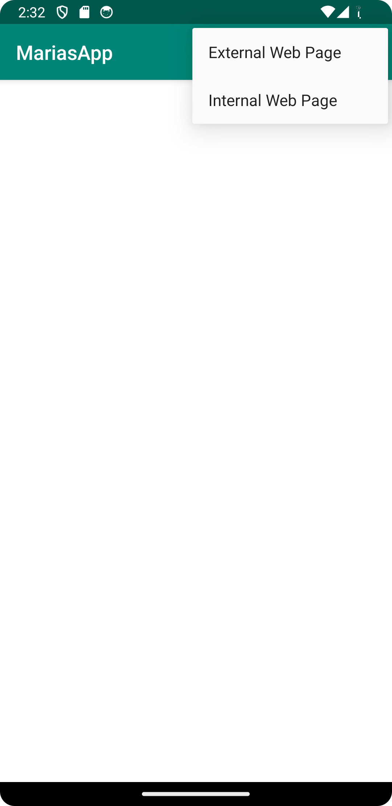

# Rapport

Jag började med att byta namn på följande vis:
```
    <resources>
        <string name="app_name">MariasApp</string>
        <string name="action_external_web">External Web Page</string>
        <string name="action_internal_web">Internal Web Page</string>
        </resources>
```

Efter detta imlementerade jag följande bit kod, detta gjordes i AndroidManifest.xml.
```

<uses-permission android:name="android.permission.INTERNET" />
```

Lade till webbview i activity_main.xml och gav den ett id på följande vis:
```

<WebView
android:id="@+id/my_webview"
android:layout_width="match_parent"
android:layout_height="match_parent"
tools:layout_editor_absoluteX="16dp"
tools:layout_editor_absoluteY="56dp" />

</androidx.constraintlayout.widget.ConstraintLayout>

```

Efter detta följde jag assigment instruktionerna och implementerade de bitar kod vi fick i dessa instruktioner. 
Detta innefattar att enable javascript, lägga till en assets folder och lägga till showExternalWebPage() och showInternalWebPage().




